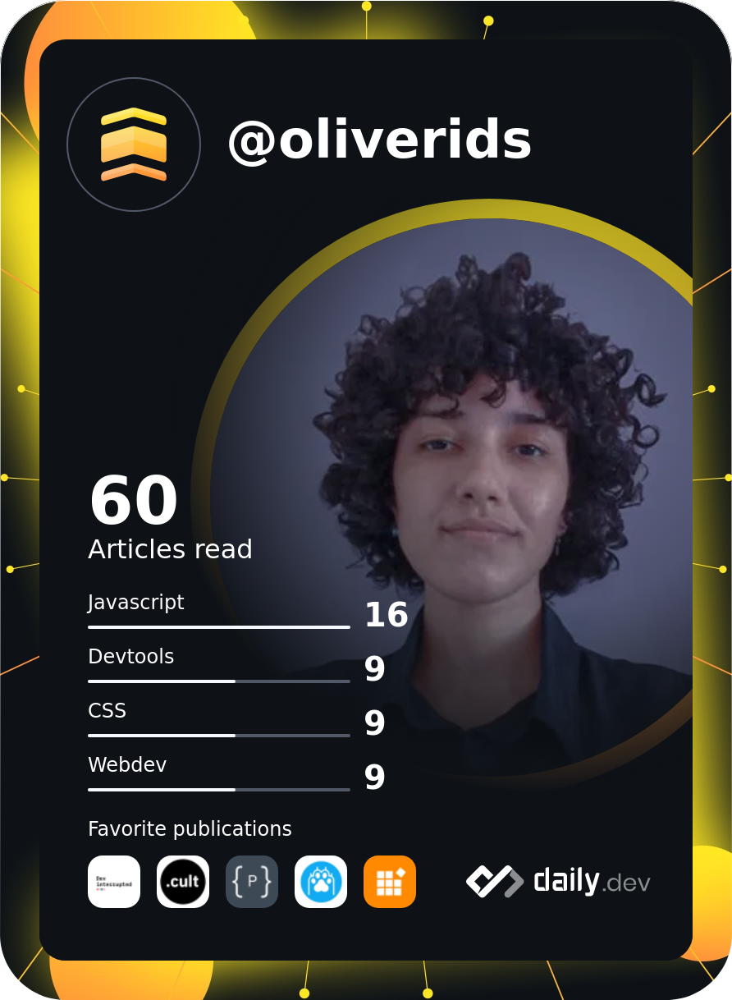

## Olá, eu sou Isabela Oliveira!
<!--  -->
<!--  -->

📚 Estudante de Design pela Universidade Federal do Espírito Santo

📚 Estudante de Análise e Desenvolvimento de Sistemas pela XP Educação

💻 Estagiária de Desenvolvimento Front-end e UI & UX Designer no laboratório for/ma - UFES

### Linguagens e Tecnologias
- **Trabalho com:** HTML, SASS, CSS, JavaScript e PHP (apenas no front-end) e desenvolvimento de PWAs
- **Estou estudando:** Node.js e React
- **Tenho interesse em:** Python com foco no Back-end

<!-- 

    
    
    

-->

Grande maioria dos meus repositórios são estudos e testes de projetos pessoais. Uma parte deles são desafios da plataforma [FrontEnd Mentor](https://www.frontendmentor.io/profile/oliverids). Fique à vontade para olhar e mandar sugestões! 😄

Eu também escrevi um <a href="https://medium.com/@oliverids/desenvolvimento-de-pwas-c82e3f6e3f28">artigo sobre desenvolvimento de Aplicativos de Web Progressivos (PWAs)</a>! Dê uma olhada!

&nbsp;

<h3 align="center"> Entre em contato!</h3>

